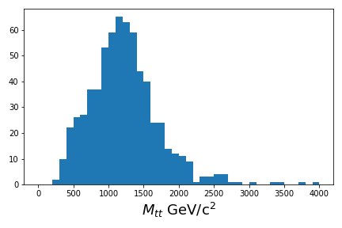

:::::::::::::::::::::::::::::::::::::: questions 

- How do you write the code that matches our physics selection criteria?
- How do we keep track of everything?
- What do we write out when we process a file?

::::::::::::::::::::::::::::::::::::::::::::::::

::::::::::::::::::::::::::::::::::::: objectives

- Learn to use `awkward` arrays to select subsets of the data
- Understand how to apply the luminosity mask
- Make a first-order plot of some of our variables of interest
- Process at least one file of both simulation and collision data

::::::::::::::::::::::::::::::::::::::::::::::::

## Introduction

There is a significant amount of code to run here and so we have written the majority of it in a Jupyter notebook. 
You can run most of the code on its own, but you should take the time to read and understand what is happening. 
In some places, you need to modify the code to get it to run. 

First, start your python docker container, following the lessons from 
[the pre-exercises](https://cms-opendata-workshop.github.io/workshop2024-lesson-docker/instructor/03-docker-for-cms-opendata.html). 
I am on a Linux machine, and I have already created the `cms_open_data_python` directory. So I will do the following

```bash
export workpath=$PWD
mkdir cms_open_data_python
chmod -R 777 cms_open_data_python
```

Start the container with

```bash
docker run -it --name my_python -P -p 8888:8888 -v ${workpath}/cms_open_data_python:/code gitlab-registry.cern.ch/cms-cloud/python-vnc:python3.10.5
```

You will get a container prompt similar this:

```output
cmsusr@4fa5ac484d6f:/code$
```

Before we start our Jupyter environment, let's download the notebook we'll be using with the following command. 

```bash
wget -O sdfsdfkjsdhfkdjshf
```

Now I will start Jupyter lab as follows. 

```bash
jupyter-lab --ip=0.0.0.0 --no-browser
```

and open the link that is printed out in the message.

:::::::::::::::: testimonial

## How to follow this lesson

While some of the code will be explained on this web page, the majority of the code
*and explanations of the code* are written out in the Jupyter notebook. Therefore, 
you should primarily following along there. 

I will use this webpage for the lesson to provide guideposts and checkpoints
that we can refer to as we work through the lesson.

:::::::::::::::::


## Running through the selection steps (in the Jupyter notebook)

### Preparing the environment

We will be making extensive use of the `uproot` and `awkward` python libraries, the `pandas`
data library, and a few other standard python libraries. The first part of the notebook 
**Install and upgrade libraries** asks you to do just that, in order to ensure a consistent
environment. 

Depending on your connection, it should take 1-2 minutes to upload and import the libraries. 

We've also prepared some helper code that makes it easier to work with the data in this lesson.
You can see the code [here](https://github.com/cms-opendata-workshop/workshop2024-lesson-event-selection/blob/main/instructors/dpoa_workshop_utilities.py)
but we will explain the functions and data objects in this notebook.

### Read in some files

Run through the notebook for the **Download essential files** section. 

::::::::: challenge

## How many input NanoAOD files will we process?

How many collision files are there? How many signal files are there? How many files are there combined in the background sample files? 

::::: solution

You will run
```bash
!wc -l FILE_LIST_*.txt
```
And get
```output
    68 FILE_LIST_Wjets.txt
   152 FILE_LIST_collision.txt
     4 FILE_LIST_signal_M2000.txt
   146 FILE_LIST_tthadronic.txt
    49 FILE_LIST_ttleptonic.txt
   138 FILE_LIST_ttsemilep.txt
   557 total
```

So there are 152 files in the `collision` dataset.

4 files in our `signal_M2000` dataset.

If we add up the background samples of `ttXXX` and `Wjets` we find there are 401 total files.

:::::

:::::::::::


### Apply the cuts

Run through the next sections in the notebook to set up the cuts. 

Check your understanding as you go. 

### Reconstruct the resonance candidate mass

To reconstruct the $z'$ candidate mass in a computationally-efficient way, we are going to make
use of the [Vector](https://vector.readthedocs.io/en/latest/) library, which works 
very well with [awkward, as you can see in these examples](https://vector.readthedocs.io/en/latest/). 

It allows for very simple code that will automatically calculate all combinations of particles
when reconstructing some parent candidate. 

### Plot

If you are able to run though **Use the cuts and calculate some values**, you should have
been able to produce a basic plot. 

::::::::: challenge

## Plot the ttbar mass

::::: solution

You will run
```python
# Get the mass
x = p4tot.mass

# Plot it!
plt.hist(ak.flatten(x), bins=40, range=(0,4000))
plt.xlabel(f'$M_{{tt}}$ GeV/c$^2$', fontsize=18)
plt.tight_layout()
plt.savefig('ttbar_mass.png');
```
If your code works, you should get a plot similar to this one. 

{alt='Plot of the calculated ttbar mass for a single datafile'}

:::::

:::::::::::

::::::::::::::::::::::::::::::::::::: keypoints 

- Awkward arrays allow for a simplified syntax when making cuts to select the data
- You need to be careful to distinguish between cuts on events and cuts on particles

::::::::::::::::::::::::::::::::::::::::::::::::

[r-markdown]: https://rmarkdown.rstudio.com/
